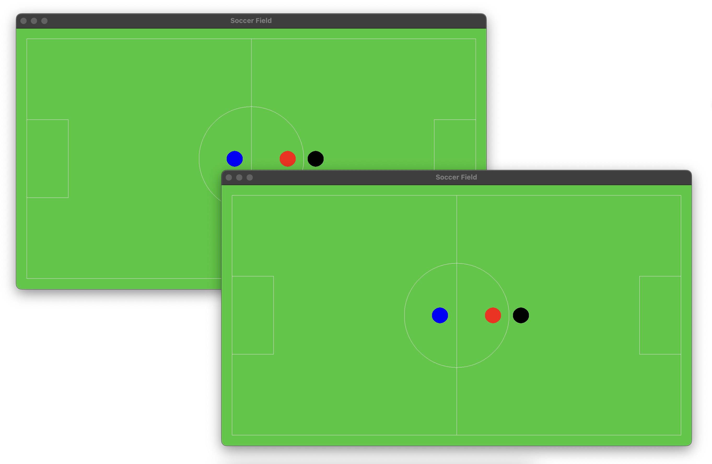
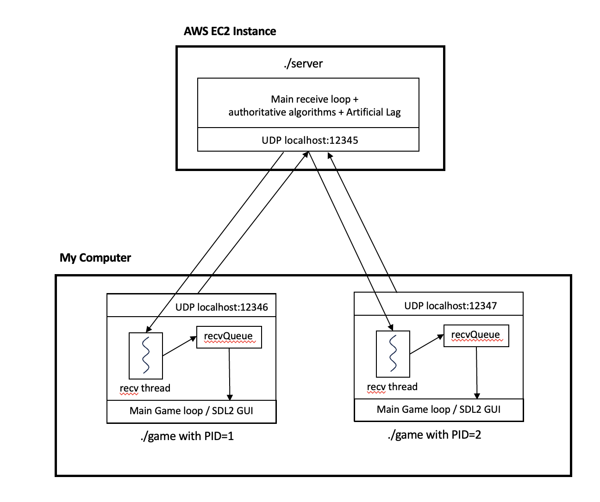
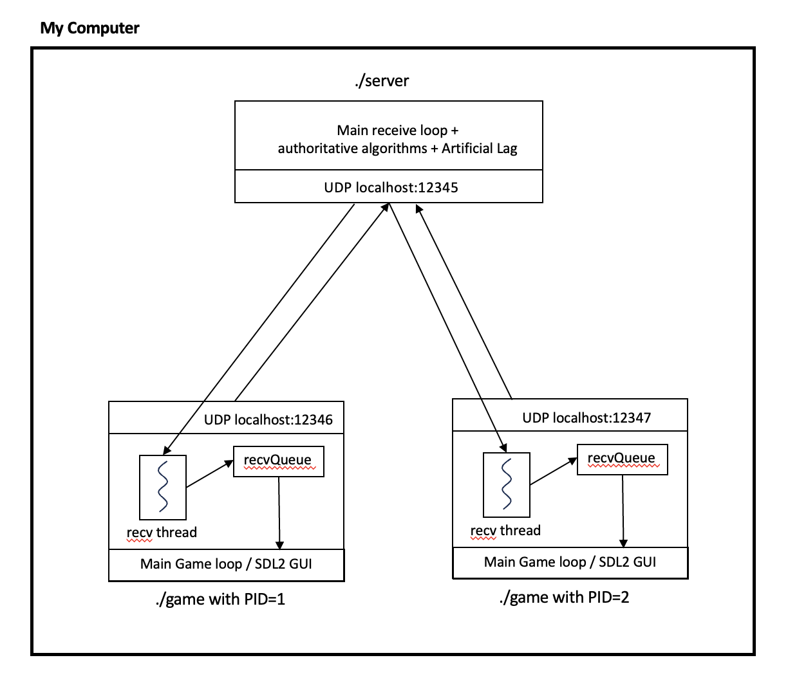

# Networked Multiplayer Game System with C++ 

I started this project back in my undergrad senior year under the guidance of Professor Kaliappa Ravindran, and then I later came back to it. Initially, the goal of the project was to meet this key requirement “What You See Is What I See” (WYSIWIS). What this means is that every player needs to maintain the same state and have the same view of the game at all times. This is still the core problem, but I expanded this project to other areas by building the GUI from scratch with SDL2 and implementing the physics.

This time I had three main goals: learn C++, learn how to use network protocols with C++, and explore an algorithm design to reduce the effect of network latency which is key in a a fast real-time system such as multiplayer games. This meant implementing algorithms such as client-prediction, server reconciliation, interpolation, etc. The end goal is a smooth and consistent experience for the player. We try to approach a single-player-like environment, by reducing the effect of network latency.

## Key Points

Designed and Implemented a Networked Multiplayer Game System in C++, featuring a centralized server network architecture utilizing UDP socket programming and flatbuffers for efficient data transmission.

Enhanced Real-Time Gameplay Responsiveness by employing synchronization algorithms, including client-side prediction, server reconciliation, and interpolation, to mitigate network latency challenges.

Implemented a Graphical User Interface using SDL2, complete with realistic physics simulations encompassing velocity, friction, and collision handling.

## Requirements

- **C++11** - This is the only language used.
- **Mac OS** - I have a Mac, but I don’t see why it wouldn’t work on other machines with the right modifications

### External Libraries

- **SDL2** - For GUI
- **flatbuffers** - serialize and deserialize data over the network

### Files

- **main.cpp** - client side game
- **server.cpp** - server code

## SDL2 GUI

## Network Architecture

My main focus was on building the networking part of an online multiplayer game, so I had to come up with an architecture with that in mind.

First I thought of using a javascript website for rendering the UI with C++ for the core algorithm on the client-side, and C++ for the server-side. So, there would be an EC2 instance for the server and each client. However, soon realized it would add extra lag to access the client's website from a remote EC2 instance. Which would add other unnecessary problems.

The final solution I came up with was to simulate the latency, and run all the clients on my computer (with different artificial latency), with different port numbers, but still have an EC2 server. This approach best simulates a real-world multiplayer player game environment, without actually having to have someone be in different locations in the world player in the game. That architecture looks like this:

For now, I realized I could just all all the programs running on my machine, as shown in the diagram below. Of course, I can later move to the previous architecture, and explore the real-world program that occurs, by actually having the packets travel through the internet.

In an ideal world, we would have different computers in different parts of the world for clients, and a person has to physically be there to test it.
